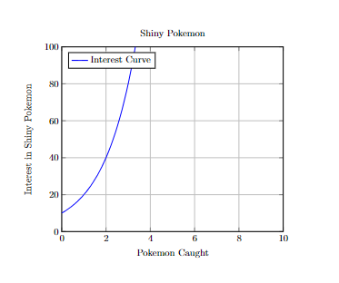

# 2023F CS2910 Project Report
**Group Members**
1. Lindsay Gatawa (0347050)
2. Oluwatomilayo Faloseyi (Student Number)

# Summary of Game
The name of the game we chose is Monopoly.It’s a game where players buy properties  and try to make the other players go bankrupt. 
On the monopoly Board, the number of squares on the Board is fixed, so we implemented the Board as an array of 40 boxes, each box has its description and actions of what is to happen if the player lands on it and things like cost of the box and rent price of the box as well as color of the box. 
Our Dice class rolls 2 dices and checks if a player has rolled the same number on each dice(Called doubles in monopoly).If they roll doubles, they play again.
In the actions class the rollDiceAndPrintTotal method then returns the total from the dice roll when the game starts and is then used by the moveFoward method to move the player.
We have 5 types of boxes that a player can land on.if a player lands on a box that tells them to pick a  Community chest or Chancecard, the player randomly picks a card from the community chest cards deck in the Cummunity chest and the advanceTo method will take the player to their new position according to the card they are instructed to pick or if they land on go to jail, the goToJail method takes them to jail and updates their current position. 
If a player lands on a LandBox or utility, if their strategy is to buy that property,our game class checks which box the player has landed on and allows them to buy that property using the makePurchase method and updates their balance.
When a player lands on Go or if they pass Go, their balance goes up by $200 as the acceptMoney method will update the balance
If the player has no sufficient funds it tells player they have no sufficient funds or if its not a player's strategy to purchase that land it tells them its not their strategy. 
if the property is already owned, the payRent method deducts money from player balance and updates it and acceptMoney method updates balance of owner of the property.If a player cannot pay rent, they are kicked out of the game and the arraylist of players is updated.
The game goes on until only one player is left in the game and declares that player as winner.
Here is a link to the Monopoly game rules :https://plentifun.com/monopoly-game-rules#:~:text=Rules%201%20The%20game%20can%20be%20played%20between,to%20equal%20number%20of%20spaces.%20...%20More%20items
Here is a Doc we created with simplified version of the rules: https://docs.google.com/document/d/1gSxD-6h8E4jefxzwkZIPWYS9vF5RNcx09XUL0vYRYDA/edit?usp=sharing

# Experiment Report
## Player Strategies
_For each of 3 strategies you implemented, name the strategy, and then description of it (100 words each)_
1. Strategy1: This strategy aims to purchase 4 properties and all the utilities before any other player,Since utilities are not as costy,
              This strategy allows the player to still attain properties and get rent from them and still be able to et double if they manage to get all 4 sets of the properties before any other player
              and also get extra money from the utilities 
2. Strategy2: This strategy aims to purchase 4 of only,The main goal of this strategy is to own 4 sets of properties,This strategy aims to mantain a good money balance for the player 
              while trying to aquire properties as well,It only focuses on purchasing all of the properties of the same color before any other player to be able to double the ammount 
              any player who would land on their properties should pay.
3. Strategy3: This strategy aims at buying any property that the player is going to land on as long as its not owned by any player 
               despite its value.It aims at aquiring as many utilities and properties as possible to capitalize on rent when a player lands in the aquired property.
               The player that uses this strategy aims to own all properties of all colors and purchase them before any other player purchases them 
               This strategy enables the player using it to receive double the normal rent if they manage to purchase 3 properties of the same color and double the double if they are able to aquire as many property sets

## Procedure
_A description of your procedure for running the experiment on your code. This should include information 
regarding the setup of the experiment in terms of what it runs and how it compares the player strategies, 
the number of trials the experiment and what data was collected. (250 words)_

## Results
_A presentation on the results of your simulation of the strategies in table(s) or appropriate graphic(s) 
with a short summary. (250 words)_

**Example Image:**

**Example Table:**

| Pokemon Caught | Interest in Shiny Pokemon |
| -------------- | --------------------------- |
| 0              | 10                          |
| 1              | 20                          |
| 2              | 40                          |
| 3              | 80                          |
| 4              | 160                         |
| 5              | 320                         |
| 6              | 640                         |
| 7              | 1280                        |
| 8              | 2560                        |
| 9              | 5120                        |
| 10             | 10240                       |

## Analysis
_An interpretation of your data explaining why one strategy is better than the other supported with 
data from your experiment.(500 words)_

# Reflection
_A reflection on your experiences with generative AI during this project. Provide a few sentences reflecting
on your experience with AI for each of the following prompts._ 

### What generative AI did you use, and what tasks did you use it for?
We use Git Co-Pilot: generated getters and setters_ and constructors

### How did you learn about the tools used by your group (delete ones that don't apply)?
_Please describe where and how you learned about the tools_

### Reflecting on your experience:
_Write a short reflection on your use of generative AI in this project, including if you did not use it. 
You may use the prompts as headings if you wish. (500 words)_  

**Prompts to think about in writing your reflections if you worked with generative AI:**
- What went well using generative AI in this project?
- What went well using generative AI?
- What didn’t go well using generative AI?
- Were there any limitations you encountered using generative AI?
- How did your solution change/evolve/improve/degrade because of the generative AI?
- What could you have done so the project turned out better?

**Prompts to think about in writing your reflections if you didn't use generative AI:**
- Why did you choose not to use generative AI in this project?
- Were there particular problems that you encountered where you think generative AI would have helped?
- Were there particular things you were glad you learned to do yourself without the use of generative AI?
- What could you have done so the project would turn out better?

# Bonus Consideration:
If you have aspects of your project you would like considered for the available bonus.